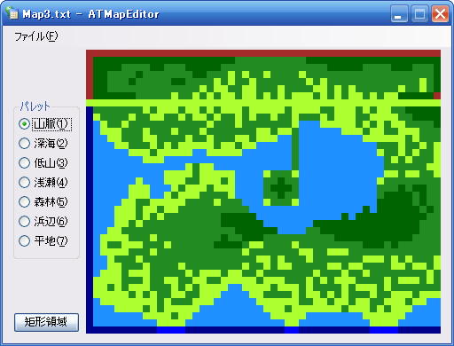

ATMapEditor
=======
都市経営シミュレーションゲーム『Association Town Ver.3.50』用非公式マップエディター。

### スクリーンショット

### 必要システム

* Windows 98, Me, 2000, XP 日本語版
* .NET Framework 2.0 以降
* マウス

### 注意事項

* このエディターはゲームシステム上のいかなる制約も考慮していません（例えば、線路上の地形を平野以外に設定するとグラフィックの不具合が生じます）。運用プレイの前にテストすることをおすすめします。
* このソフトウェアは非公式改造ツールの一種になります。これを使用して生じた不具合について作者に問い合わせないでください。
* このソフトウェアを使用していかなる問題が発生しようと、作者は一切の責任を負いません。

### ライセンス

ファイル LICENSE を参照。
